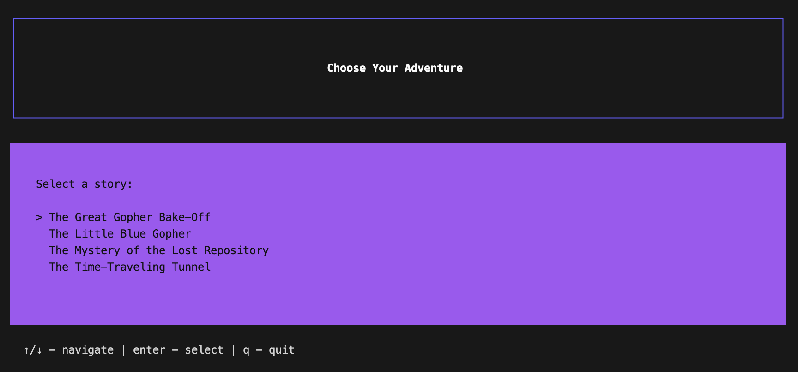

# StoryTEL



<h2 align="center"><i>A Terminal-based Choose Your Own Adventure Game</i></h2>

  <p align="center">
  <a href="https://golang.org/doc/go1.14">
    
  </a> 
  <a href="https://opensource.org/licenses/MIT">
    
  </a>
  <a>
    
  </a>
  </p>


## Intro

StoryTEL is a terminal-based interactive story application built with Go, [Bubble Tea](https://github.com/charmbracelet/bubbletea), and [Lip Gloss](https://github.com/charmbracelet/lipgloss).

Many thanks to [Claude](https://www.anthropic.com/claude-code) for writing The Great Gopher Bake-Off, The Mystery of the Lost Repository, and The Time-Traveling Tunnel.

## Features

- Multiple story selection from a menu
- Interactive story navigation with keyboard controls
- Beautiful terminal UI with styled text boxes
- Support for custom story files in JSON format

## Installation

```bash
go build -o storytel ./cmd/storytel
```

## Usage

Run the application:
```bash
./storytel
```

### Controls

**Story Selection Mode:**
- `↑/↓` or `j/k` - Navigate through stories
- `Enter` - Select a story
- `q` - Quit

**Story Playing Mode:**
- `↑/↓` or `j/k` - Navigate through options
- `Enter` - Select an option
- `q` - Quit

## Story Format

Stories are stored as JSON files in the `stories/` directory. Each story follows this structure:

```json
{
  "chapter-name": {
    "title": "Chapter Title",
    "story": [
      "First paragraph",
      "Second paragraph"
    ],
    "options": [
      {
        "text": "Option text",
        "arc": "next-chapter-name"
      }
    ]
  }
}
```

## Adding New Stories

1. Create a new JSON file in the `stories/` directory
2. Follow the story format above
3. Include an "intro" chapter as the entry point
4. The application will automatically detect and list new stories

## Project Structure

```
.
├── cmd/storytel/      # Main application entry point
├── pkg/
│   ├── parser/        # JSON story parser
│   ├── tui/           # Terminal UI components
│   └── types/         # Shared type definitions
└── stories/           # Story JSON files
```
> [!NOTE]
> `handler/` and `story/` folders are non-functional for now. The original version of this exercise required you to generate and serve templated HTML but I had way more fun with BubbleTea.

## Dependencies

- [Bubble Tea](https://github.com/charmbracelet/bubbletea) - Terminal UI framework
- [Lip Gloss](https://github.com/charmbracelet/lipgloss) - Terminal styling

## License

This project is part of the Gophercises exercise series.
